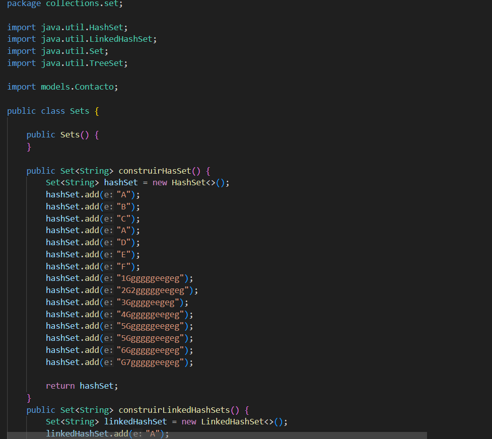
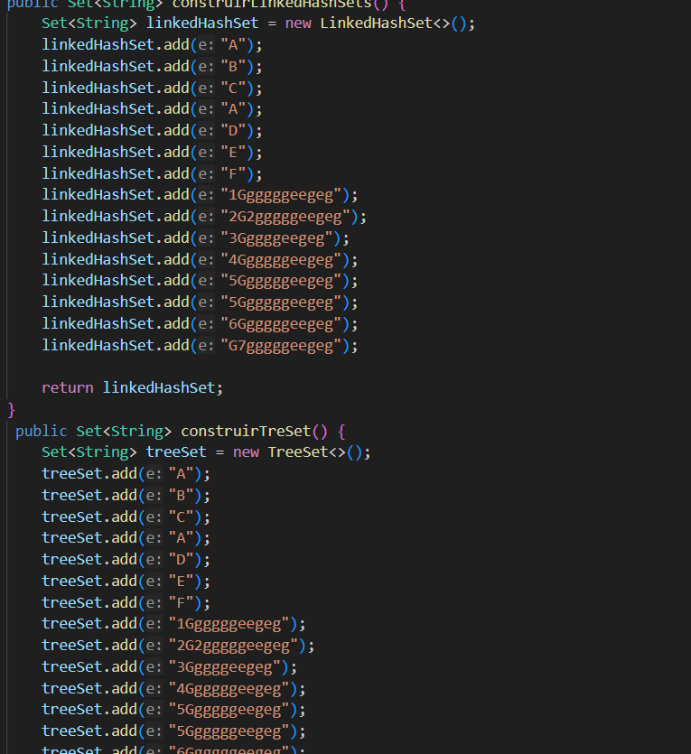
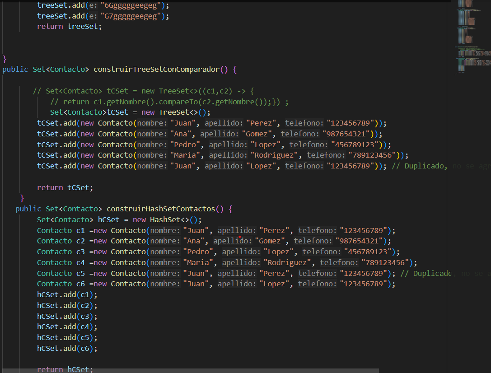
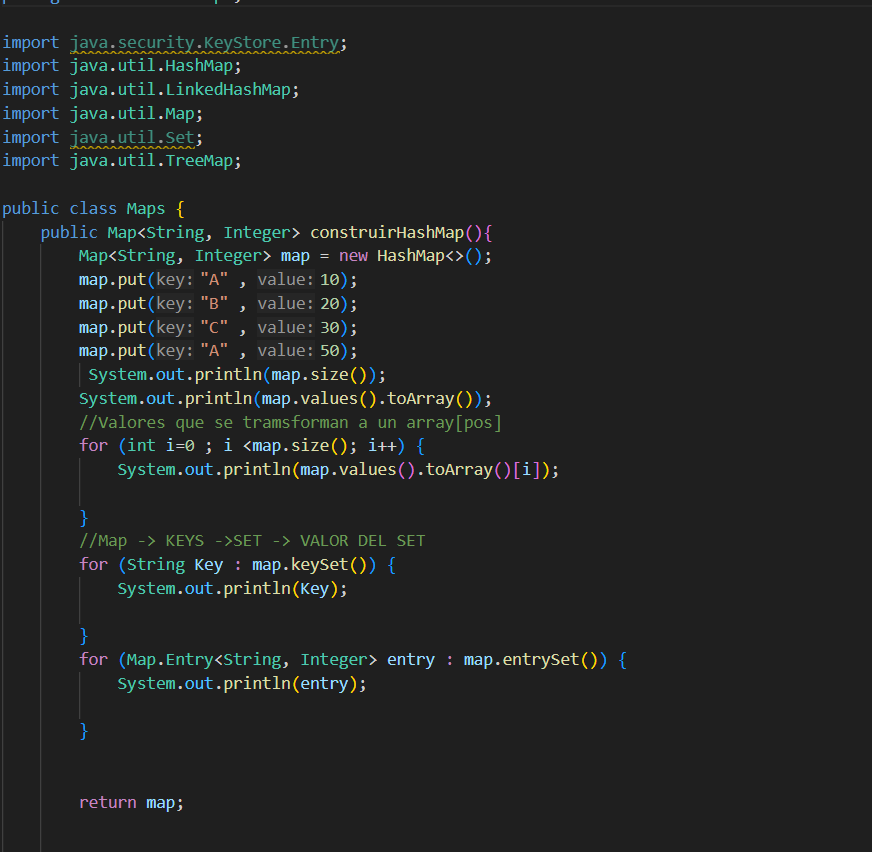
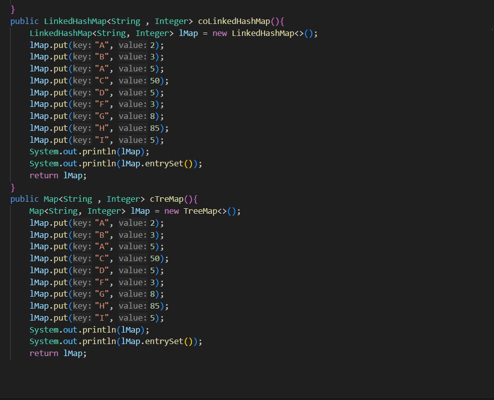
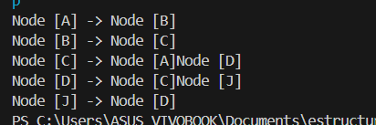

# Práctica: Arbol Binario

## Datos del Estudiante
- **Nombre:** Andrea Sagbay
- **Curso:** Grupo 3 
- **Fecha:** 16/06/2026

---

## 1. Implementación del Arbol Binario con PreOrder, PosOrder, InOrder, Niveles y altura

**Fecha:** [16/06/2026]

**Descripción:**  Aprendimos como funcionan los arboles binarios con su diferentes recorridos (preOrden, posOrden, inOrden y por niveles).

# Práctica: Arbol Binario Generico

## Datos del Estudiante
- **Nombre:** Andrea Sagbay
- **Curso:** Grupo 3 
- **Fecha:** 17/06/2026

---

## 2. Implementación de Arbol Binario Genrico

**Fecha:** [02/06/2026]

**Descripción:** Continuamos con el Árbol Binario y empleamos clases genéricas. También incorporamos un método para determinar el peso del árbol, que representa el número de nodos. Además, utilizamos CompareTo para realizar comparaciones basadas en el nombre o la edad.

## 3 Práctica de los diferentes de Conjuntos
 **Descripcion:** En esta práctica aprendimos a utilizar los diferentes tipos de Set en Java: HashSet, LinkedHashSet y TreeSet. El HashSet no permite elementos duplicados, pero no mantiene un orden específico. El LinkedHashSet tampoco acepta duplicados, pero conserva el orden en que se agregan los elementos. Por último, el TreeSet además de evitar duplicados, mantiene los elementos ordenados automáticamente, lo que resulta muy útil cuando se trabaja con objetos utilizando un comparador para definir el criterio de ordenamiento.

 
 
 
## 4 Práctica de los diferentes Mapas
 **Descripcion:**En esta práctica aprendimos a utilizar los Map en Java, que permiten almacenar la información mediante pares de clave y valor. También conocimos sus principales implementaciones: HashMap, LinkedHashMap y TreeMap. En los tres casos, las claves no pueden repetirse. El HashMap no mantiene un orden específico de las claves. El LinkedHashMap conserva el orden en que las claves fueron agregadas. Por último, el TreeMap organiza las claves automáticamente siguiendo un orden natural, como el alfabético, y también permite usar un comparador cuando se necesita definir un criterio de orden para objetos.
 

## Grafos

