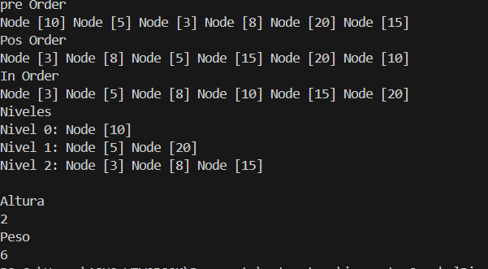
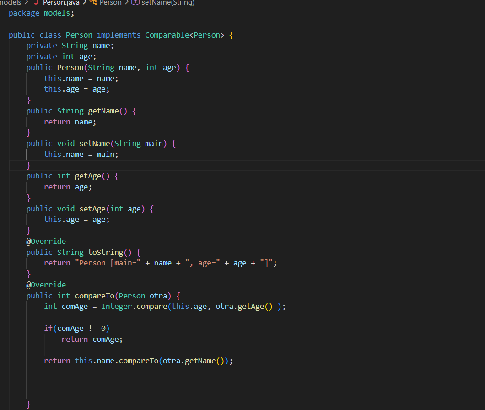

# Práctica: Arbol Binario

## Datos del Estudiante
- **Nombre:** Andrea Sagbay
- **Curso:** Grupo 3 
- **Fecha:** 16/06/2026

---

## 1. Implementación del Arbol Binario con PreOrder, PosOrder, InOrder, Niveles y altura

**Fecha:** [16/06/2026]

**Descripción:**  Aprendimos como funcionan los arboles binarios con su diferentes recorridos (preOrden, posOrden, inOrden y por niveles).

# Práctica: Arbol Binario Generico

## Datos del Estudiante
- **Nombre:** Andrea Sagbay
- **Curso:** Grupo 3 
- **Fecha:** 17/06/2026

---

## 2. Implementación de Arbol Binario Genrico

**Fecha:** [02/06/2026]

**Descripción:** Continuamos con el Árbol Binario y empleamos clases genéricas. También incorporamos un método para determinar el peso del árbol, que representa el número de nodos. Además, utilizamos CompareTo para realizar comparaciones basadas en el nombre o la edad.

