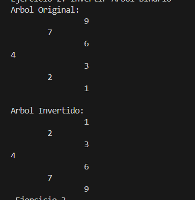
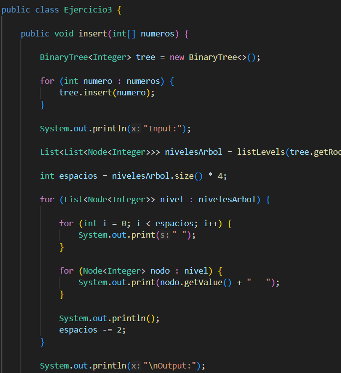
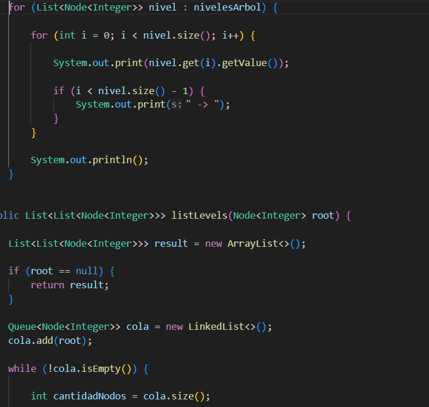
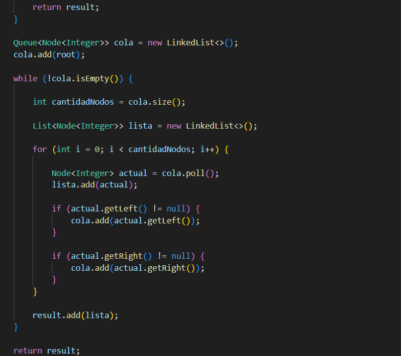
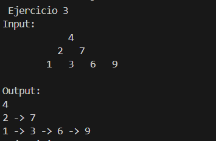
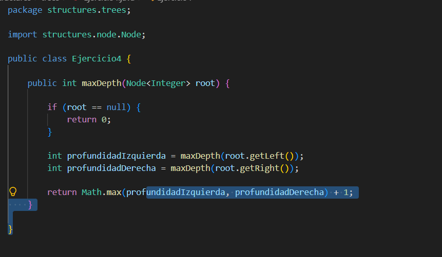
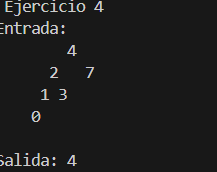

## Informe 
## Ejercicio 1
En este ejercicio se creó un árbol binario con  números almacenados en un arreglo, cada número se fue insertando en la posición que le corresponde dentro del árbol, se imprimió la estructura para observar cómo quedaron organizados los nodos.

## Ejercicio 2
En este ejercicio se realizó la inversión de un árbol binario. Para lograrlo, se intercambiaron los hijos izquierdo y derecho de cada nodo utilizando recursividad.

## Ejercicio 3
En este ejercicio se recorrió el árbol por niveles y se guardaron los nodos de cada nivel en una lista. Después se mostraron los niveles obtenidos.

## Ejercicio 4
En este ejercicio se calculó la profundidad máxima del árbol binario. Para ello se comparó la profundidad de las ramas izquierda y derecha y se obtuvo la mayor.

