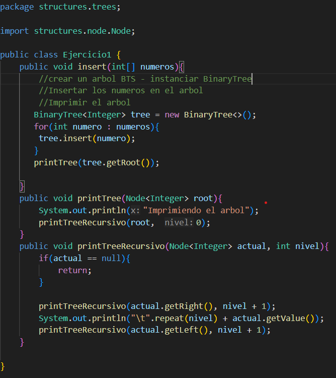
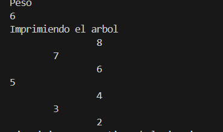
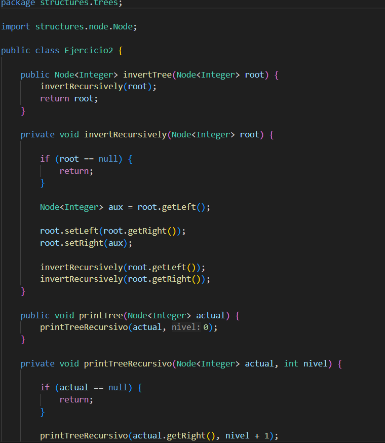

## Informe 
## Ejercicio 1
En este ejercicio se creó un árbol binario con  números almacenados en un arreglo, cada número se fue insertando en la posición que le corresponde dentro del árbol, se imprimió la estructura para observar cómo quedaron organizados los nodos.

## Ejercicio 2
En este ejercicio se realizó la inversión de un árbol binario. Para lograrlo, se intercambiaron los hijos izquierdo y derecho de cada nodo utilizando recursividad.
